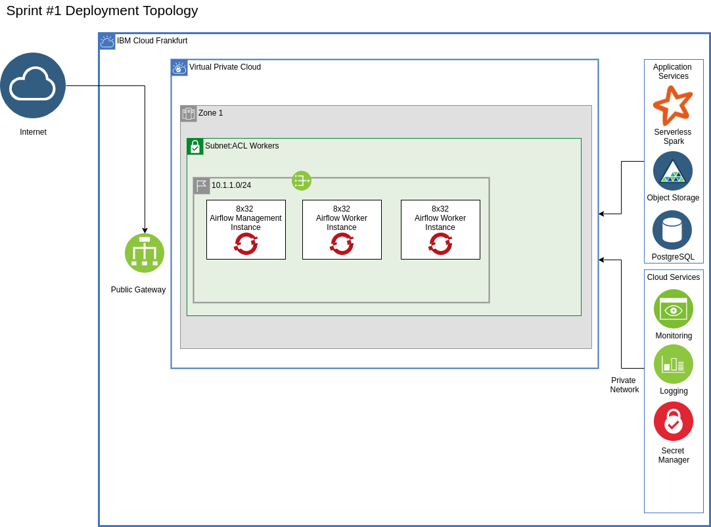

# os-sustainable-finance-ref-arch
Reference Architecture for OS-SFT project

This reference architecture was built using the [quick start automation reference architecture](https://github.com/IBM/automation-ibmcloud-infra-openshift/tree/main/1-quickstart) with a view to progressing to the [IBM Cloud for Financial Services](https://github.com/IBM/ibm-cloud-reference-architectures/) implementation as the we understand the requirements and components.



## pre-reqs

- Have access to an IBM Cloud Account, Enterprise account is best for workload isolation but if you only have a Pay Go account this set of terraform can be run in that level of account.
- Terraform 1.2.9 (1.3 is not supported as `Experiment "module_variable_optional_attrs" is no longer available.` and is a [breaking change](https://github.com/hashicorp/terraform/issues/31692))
- jq - [Install 1.6](https://stedolan.github.io/jq/download/) Other versions may work
- yq - [Install 4.28.2](https://github.com/mikefarah/yq#install) Other versions may work
- iascable - [Install 2.25.5 or above](https://github.com/cloud-native-toolkit/iascable#installation) Earlier versions are not supported due to known issues.

## deploy 

Set up a env var with an [IBM Cloud API Key](https://cloud.ibm.com/iam/apikeys)
```
export TF_VAR_ibmcloud_api_key=xxx
```

## install

1. Currently the generated config based on the [quick start](https://github.com/IBM/automation-ibmcloud-infra-openshift/tree/main/1-quickstart) is stored here so it's just a matter of running the terraform script.

    ```
    cd 105-ibm-vpc-openshift
    terraform init
    terraform apply -auto-approve
    ```

## A serverless backend for Terraform
This is an implementation of [http](https://developer.hashicorp.com/terraform/language/settings/backends/http) backend which stores Terraform states using a REST client.

## Step 1 - Prepare the backend
This first step utilises Terraform to create the following:
- a resource group,
- a COS instance with a bucket,
- Cloud Functions namespace, package and action.

1. Change to the step directory
``cd prepare-backend``

2. Copy the terraform configuration

``cp terraform.tfvars.template terraform.tfvars`` and update the configuration.

3. Create the resources

```
terraform init
terraform apply -auto-approve
```

## Step 2 - Use the backend

1. Navigate to the main project directory
``cd 105-ibm-vpc-openshift``

2. Load the backend configuration variables
``source backend.env``

3. Initialise the backend and apply the configuration
```
terraform init
terraform apply -auto-approve
```


